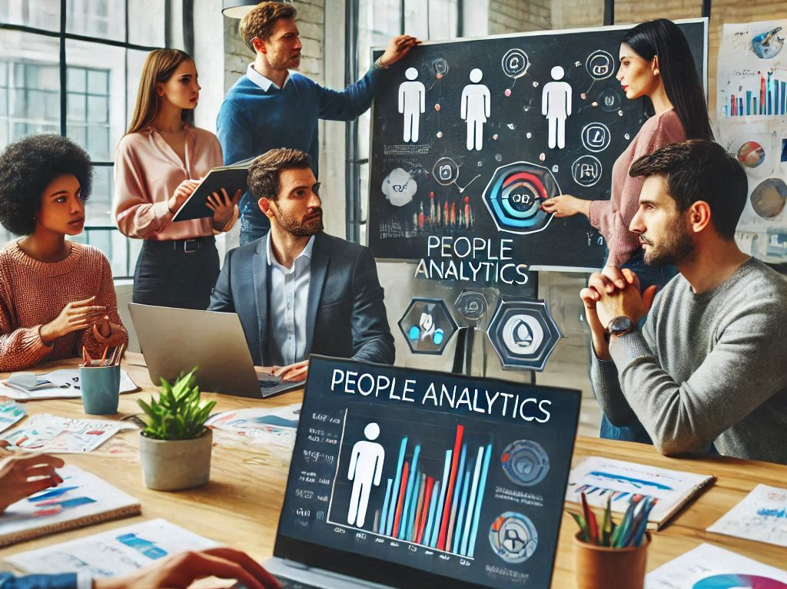

# 📊 People Analytics Dashboard Power BI

## 📋 Introduction

Welcome to the **People Analytics** repository created with Power BI! 
This project aims to provide, analyze, and visualize employee-related data such as retention, performance, satisfaction, and more.

## 🎯 Objectives

The objective of this project is to provide an interactive and detailed analysis of key employee metrics to support strategic decision-making. This includes leveraging both Power BI for interactive dashboards and Python for data analysis, cleaning, and visualization.

## 🚀 Functionality

This project includes:

- 📈 **Interactive visualizations**: Pivot charts and tables in Power BI to explore data.
- 📊 **Key metrics**: Analysis of important KPIs such as retention, performance, satisfaction, and more.
- 📅 **Temporal analysis**: Trends over time to identify patterns and opportunities.
- 🗂️ **Three tabs in Power BI**:
  - 🌍 **General Analysis**: Overview of all metrics.
  - 📦 **Labor Analysis**: Detailed analysis of NPS, FTE, absenteeism, training hours, sanctions, and other metrics.
  - 📊 **Summary**: Dynamic table of employees, hiring trends, working hours, among other analyzed measures.
- 🐍 **Python Analysis**:
  - 🧹 **Data Cleaning**: Using pandas for data cleaning and preprocessing.
  - 📊 **Visualization**: Using matplotlib and seaborn for data visualization.

## 🛠️ Tools Used

- 🖥️ **Power BI**: For creating the interactive dashboard.
- 🐍 **Python**: For data analysis.
  - 🐼 **pandas**: Data cleaning and preprocessing.
  - 📊 **matplotlib and seaborn**: Data visualization.

## 🔄 Development Process

- 📥 **Extraction**: Data obtained from CSV files.
- 🔄 **Transformation**:
  - 🖥️ **Power BI**:
    - 🔗 Combining tables using Power Query.
    - 🧹 Data cleaning: Removing duplicates, handling null values, and normalizing data.
    - 📈 Data enrichment: Adding calculated columns and transforming data to improve analysis.
  - 🐍 **Python**:
    - 🧹 Data cleaning with pandas: Removing duplicates, handling null values, and normalizing data.
    - 📈 Data enrichment: Adding calculated columns and transforming data to improve analysis.
- 📤 **Load**:
  - 🖥️ **Power BI**: Integrating transformed data into Power BI for analysis and visualization.
  - 🐍 **Python**: Preparing data for visualization and analysis in Jupyter notebooks.

## 📈 Results

Various metrics have been created using DAX (Data Analysis Expressions) in Power BI to provide detailed and customized analysis:

- 📊 KPIs calculation.
- 📏 Calculated measures for specific analyses.
- ➕ Calculated columns to enrich the data.
- 🔍 Filtering and dynamic segmentation of data.

In Python, the analysis includes:

- 🧹 Detailed data cleaning processes.
- 📊 Creation of visualizations to explore and present data insights.

## 📊 Power BI Dashboard

Here are some screenshots of the Power BI dashboard:

## 📊 Visualizations

In addition to the Power BI dashboard, a complete analysis has been performed using Python, including:

### 🧹 Data Cleaning with Pandas:

- **Removing Duplicates**: Ensuring that the dataset is free from duplicate entries to maintain data integrity.
- **Handling Missing Values**: Addressing missing data points through imputation or removal to ensure a complete dataset.

### 📊 Data Visualization with Matplotlib and Seaborn:

- **Histograms and Bar Charts**: Visualizing the distribution of data and comparing different categories.
- **Line Charts**: Analyzing trends over time to identify patterns and opportunities.
- **Scatter Plots**: Exploring relationships between different variables to uncover correlations.
- **Heatmaps**: Providing a visual representation of data density and relationships between variables.
- **Box Plots**: Summarizing the distribution of data and identifying outliers.

## 📂 Project Structure

- `app/`: Streamlit app to present the results.
  - `app.py`: Main script for the Streamlit app.
- `assets/`: Directory for app assets like images and logos.
  - 🖼️ `menu.png`: Menu image.
  - 🖼️ `portada.png`: Cover image.
- `data/`: Directory for raw and processed data.
  - 📄 `data.csv`: Raw marketing campaign data.
  - 📄 `data_cleaned.csv`: Cleaned marketing campaign data.
- `images/`: Directory for Power BI screenshots.
  - 🖼️ `general_analysis.png`: Power BI screenshot 1.
  - 🖼️ `labor_analysis.png`: Power BI screenshot 2.
  - 🖼️ `summary.png`: Power BI screenshot 3.
- `notebooks/`: Jupyter notebooks with the Python analysis.
  - 📓 `data_cleaning.ipynb`: Notebook for data cleaning.
  - 📓 `data_visualization.ipynb`: Notebook for data visualization.
- `powerbi/`: Directory for Power BI files.
  - 📊 `dashboard.pbix`: Main file of the Power BI dashboard.
- 🚫 `.gitignore`: Git ignore file.
- 📜 `LICENSE`: [License file](LICENSE).
- 📄 `README.md`: Readme file.
- 📋 `requirements.txt`: Python dependencies file.

## 🛠️ Requirements

- Power BI Desktop
- Python 3.x
- Required Python libraries (listed in `requirements.txt`)

## 📧 Contact

For any inquiries, you can contact me at:

- 📧 Email: jotaduranbon@gmail.com
- 💼 LinkedIn: [Juan Duran Bon](https://www.linkedin.com/in/juan-duran-bon)

## 💡 Suggestions and Contributions

Suggestions and contributions are welcome. Please open an issue or submit a pull request to discuss any changes you would like to make. Here are some ways you can contribute:

- 🐛 **Report Bugs**: If you find any bugs, please report them by opening an issue.
- 🌟 **Feature Requests**: If you have ideas for new features, feel free to suggest them.
- 💻 **Code Contributions**: You can contribute by fixing bugs, adding new features, or improving the documentation.
- 📝 **Feedback**: Any feedback to improve the project is highly appreciated.

## 📜 License

This project is licensed under the MIT License. See the [LICENSE](LICENSE) file for more details.

---

Thank you for visiting the **People Analytics** project! We hope you find the insights and visualizations helpful for your strategic decision-making. Happy analyzing! 🚀
