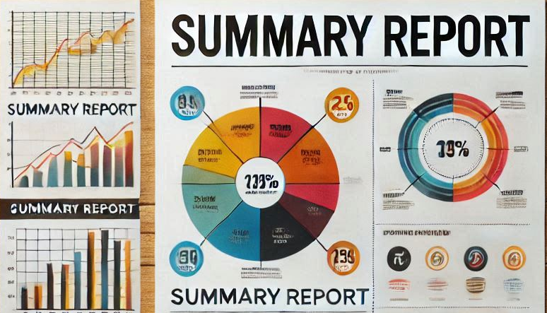

# 📊 Summary Report

This directory contains images of the various charts and graphs generated during the analysis, along with brief descriptions of each.

## 📊 Visualizations

- **📈 Age Distribution**: Shows the distribution of employee ages within the company.
- **👥 Gender Distribution**: Displays the count of employees by gender.
- **💍 Marital Status Distribution**: Illustrates the distribution of employees' marital status.
- **🎓 Education Level Distribution**: Shows the distribution of employees' education levels.
- **🏢 Department Distribution**: Displays the count of employees in each department.
- **💰 Salary Distribution**: Shows the distribution of annual salaries for 2020.
- **💵 Salary by Gender**: Compares annual salaries for 2020 between genders.
- **🏢 Salary by Department**: Compares annual salaries for 2020 across different departments.
- **🎓 Salary by Education Level**: Compares annual salaries for 2020 based on education levels.
- **📅 Tenure Distribution**: Shows the distribution of employees' tenure in months.
- **🏢 Tenure by Department**: Compares tenure in months across different departments.
- **🏢 Training Hours by Department**: Compares training hours received across different departments.
- **🏢 Absenteeism by Department**: Compares days of work lost across different departments.
- **🔄 External Rotation Distribution**: Displays the count of employees who have experienced external rotation.
- **🔄 Internal Rotation Distribution**: Displays the count of employees who have experienced internal rotation.
- **📈 NPS Distribution**: Shows the distribution of Net Promoter Scores (NPS).

## 📊 Key Metrics

### 🔄 Turnover Rate

- **Definition**: The percentage of employees who leave the company during a specific period.
- **Calculation**: Turnover Rate = (Number of terminations during a period / Total number of employees during that period) * 100

### 📈 Net Promoter Score (NPS)

- **Definition**: Measures employee loyalty and likelihood to recommend the company.
- **Calculation**: NPS = % Promoters - % Detractors
- **Groups**:
  - **Promoters**: Score 9-10
  - **Passives**: Score 7-8
  - **Detractors**: Score 1-6

### 📉 Absenteeism Rate

- **Definition**: The percentage of work hours lost due to absenteeism.
- **Calculation**: Absenteeism Rate = (Hours not worked due to occasional causes, IT, or other reasons / Effective agreed hours) * 100
- **Effective Agreed Hours**: Agreed hours + Overtime hours - Hours not worked due to vacations and holidays

These visualizations provide a comprehensive overview of the dataset, highlighting key aspects such as demographics, salary, tenure, training, absenteeism, rotation, performance, and NPS.

---